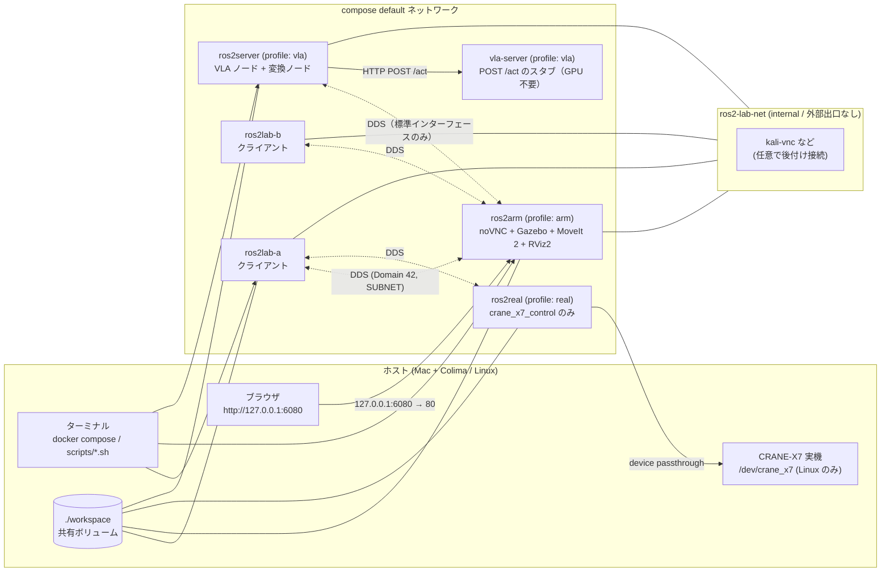
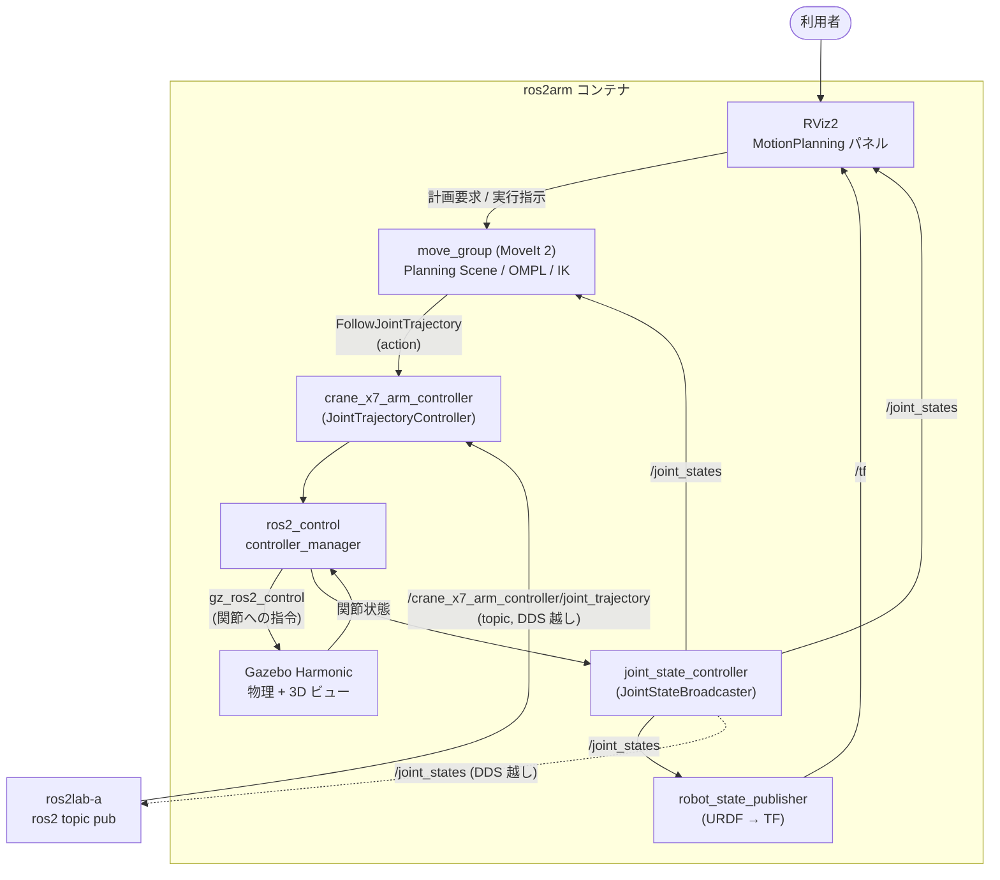

# アームシミュ構成: Gazebo / MoveIt 2 / RViz2 の詳細・アーキテクチャ図・サービスブループリント

Factory I/O は Windows 専用のため、このリポジトリでは Gazebo + MoveIt 2 + RViz2 を
Docker（`ros2arm`）上で動かして代替している。このドキュメントは次の 3 点をまとめる。

1. 3 つのツールの役割と、どう連携するか
2. アーキテクチャ図（コンテナ・ネットワーク・ROS 2 のデータフロー）
3. サービスブループリント（利用者の体験を、見える層・見えない層・支援プロセスに分解）

同内容の HTML 版（図を SVG で描画）: [arm-sim-architecture.html](arm-sim-architecture.html)

> 動作状況の前提（README と同じ）: シミュ（`ros2arm`）は動作確認済み。実機（`ros2real`）は
> ビルド・compose 検証・モックのドライバ起動まで。実機での動作は未確認。

---

## 1. 3 つのツールの詳細

### 1.1 役割分担（一言）

| ツール | 一言 | Factory I/O でいうと | 担当する問い |
|---|---|---|---|
| **Gazebo Harmonic** | 物理シミュレータ（世界そのもの） | 3D の工場シーン本体 | 「物体は重力・摩擦・接触でどう動くか」 |
| **MoveIt 2** | 動作計画（アームの頭脳） | PLC のロジックに近い立ち位置（ただし対象は関節空間） | 「障害物を避けて、どの関節角の列で動けばよいか」 |
| **RViz2** | 可視化 + 操作 UI（計器盤） | 画面上の HMI / 操作盤 | 「今ロボットと計画は何を認識しているか」 |

重要な違い: **Gazebo は「現実の代わり」、RViz2 は「ロボットの頭の中の表示」**。
Gazebo の画面と RViz2 の画面は別物で、RViz2 に映るのは ROS 2 のトピック（`/joint_states`・
TF・計画シーン）から再構築した像。実機に繋ぎ替えても RViz2 側は同じように動く。

### 1.2 Gazebo Harmonic

- gz-sim 系の後継シミュレータ。物理エンジン（既定 DART）、センサ、レンダリング、プラグインを持つ。
- ROS 2 とは **`ros_gz`（ブリッジ）** と **`gz_ros2_control`（ros2_control のハードウェア層をシミュで置き換えるプラグイン）** で繋がる。
- アームの関節は Gazebo 側の物理で動き、`joint_state_controller`（型は `JointStateBroadcaster`）が `/joint_states` を ROS 2 に流す。
- このリポジトリでは Gazebo 本体はベースイメージ（`tiryoh/ros2-desktop-vnc`）に同梱。
  CRANE-X7（`crane_x7_gazebo`）と UR（`ur_simulation_gz`）が Gazebo 上でアームを動かす。
- 描画は CPU（noVNC 経由）なので重い。デモは同時に 1 つだけ起動する運用にしている。

### 1.3 MoveIt 2

`move_group` ノードが中心で、内部に次のパーツを持つ。

| パーツ | 役割 |
|---|---|
| Planning Scene | ロボット + 障害物の世界モデル。衝突判定（FCL）の入力 |
| Planner（OMPL など） | 始点・終点の関節角から、衝突しない経路を探索する |
| IK ソルバ（KDL / 他） | 「手先をこの位置に」→ 関節角へ逆運動学で変換する |
| Trajectory processing | 経路に時間と速度・加速度を付けて、実行可能な軌道にする |
| Controller interface | 軌道を `FollowJointTrajectory` アクションとして controller に送る |

アーム固有の情報（関節、グループ、IK、衝突除外ペア）は `*_moveit_config` パッケージの
SRDF / YAML が持つ。このリポジトリでは Panda（`moveit_resources_panda_moveit_config`）、
UR（`ur_moveit_config`）、CRANE-X7（`crane_x7_moveit_config`、`/opt/crane_ws`）を使う。

### 1.4 RViz2

- 3D ビューア。MoveIt 2 用の **MotionPlanning パネル**（Planning Request / Plan / Execute /
  インタラクティブマーカーで手先をドラッグ）を持つ。
- 表示の入力は `/joint_states`、TF（`robot_state_publisher` が URDF から生成）、
  `move_group` の計画シーン・軌道。
- 「Plan & Execute」ボタンの裏では、RViz2 が `move_group` に計画を要求し、
  `move_group` が controller に軌道を送っている（RViz2 自身は動かさない）。

### 1.5 制御の連鎖（ros2_control）

アームを動かす経路は、シミュでも実機でも **controller 名が同じ** なのがこの構成の核。

```
MoveIt 2 (move_group)
  └─ FollowJointTrajectory ─▶ crane_x7_arm_controller   ← JointTrajectoryController
                                  └─ ros2_control (controller_manager, 200Hz 級)
                                        └─ ハードウェア層  ← ここだけが差し替わる
                                              ・シミュ: Gazebo（gz_ros2_control）
                                              ・実機  : CRANE-X7 ドライバ（Dynamixel, /dev/crane_x7）
```

README の `ros2lab` から送る `ros2 topic pub /crane_x7_arm_controller/joint_trajectory ...` は、
MoveIt 2 を **経由せず** controller に直接軌道を渡す経路。MoveIt 2 の経路は
`FollowJointTrajectory` アクション。どちらも最後は同じ controller に届く。

### 1.6 Factory I/O との差（置き換えで失うもの・得るもの）

| 観点 | Factory I/O | Gazebo + MoveIt 2 + RViz2 |
|---|---|---|
| 得意 | 工場ライン（コンベア・センサ・PLC の I/O） | ロボットアームの運動・物理・衝突回避 |
| 制御の対象 | PLC のタグ（入出力点） | ROS 2 のトピック / アクション（関節角） |
| 動作環境 | Windows 専用 | Linux / Mac（Docker + ブラウザ） |
| 物理 | 簡易（ライン用途） | 剛体物理・接触・センサを持つ |
| 失うもの | PLC 連携（Modbus / OPC UA）、コンベア・ワークの既製部品 | — |
| 補う手段（未実装） | — | コンベアやワークは Gazebo のモデル / プラグインで自作。PLC 連携が必要なら OpenPLC や ROS 2 ブリッジを別途検討 |

つまり **「アームの制御・動作計画の学習」の代替としては成立する**が、
**PLC を含む工場ライン全体の模擬** は、そのままは代替できない（このリポジトリのスコープ外）。

---

## 2. アーキテクチャ図

### 2.1 コンテナ・ネットワーク構成



- `ros2arm` と `ros2real` は**同時に起動しない**（同名 controller が二重になる）。`scripts/up-*.sh` が相互に拒否する。
- `ros2real` は `ros2-lab-net` に繋がない（DDS が無認証のため）。
- noVNC は `127.0.0.1` のみ公開。
- `ros2server` は VLA（OpenVLA）の手先差分でアームを動かす ROS 2 側、`vla-server` は推論サーバー（スタブ。本物は別マシンの GPU）。`ros2arm` には手を入れず、DDS 越しに標準インターフェースで呼ぶ。`vla-server` は `default` のみ、`127.0.0.1:8000` で公開。詳細は [openvla-ros2-bridge.md](openvla-ros2-bridge.md)。

### 2.2 `ros2arm` 内部の ROS 2 データフロー



> 補足: `gz_ros2_control` 利用時、`controller_manager` は Gazebo プロセス内（プラグイン）で動く。
> 図では役割を分けるため別ボックスで描いている。controller 名は上流の
> `crane_x7_control/config/crane_x7_controllers.yaml` に合わせた（`joint_state_controller` /
> `crane_x7_arm_controller` / `crane_x7_gripper_controller`）。

### 2.3 シミュ ⇄ 実機の差し替え点

| レイヤ | シミュ（`ros2arm`） | 実機（`ros2real`） | 共通か |
|---|---|---|---|
| クライアント（`ros2lab`） | 同じコマンド | 同じコマンド | 共通 |
| トピック / アクション名 | `/crane_x7_arm_controller/joint_trajectory` ほか | 同じ | 共通 |
| MoveIt 2 / RViz2 | `ros2arm` 内 | このリポジトリでは `ros2real` に含めない（ドライバのみ） | 実機側は別途要検討 |
| ハードウェア層 | Gazebo | Dynamixel サーボ（`/dev/crane_x7`） | **差し替え** |
| ホスト要件 | Docker のみ | Linux + udev rule + USB | 差あり |

> 注意: Panda デモ（`moveit_resources_panda_moveit_config` の `demo.launch.py`）は、
> Gazebo ではなく ros2_control の疑似ハードウェア（mock）で動く MoveIt + RViz のみの構成。
> Gazebo が絡むのは CRANE-X7 と UR のデモ。

---

## 3. サービスブループリント

サービスブループリントは「利用者の体験」を、**利用者から見える層**と**見えない層**に分けて、
各段階を支える仕組みと失敗点を並べる設計図。ここでの「利用者」は、
ロボット制御を学ぶ開発者（このリポジトリの利用者）。
「サービス」は「ブラウザだけでアームの制御・動作計画を試せる体験」。

### 3.1 ブループリント本体（シミュ編）

| 層 | ① 準備 | ② 起動 | ③ 接続 | ④ デモ実行 | ⑤ 計画・実行 | ⑥ クライアントから指令 | ⑦ 終了 |
|---|---|---|---|---|---|---|---|
| **利用者の行動** | Colima を起動し、リソースを確認する | `bash scripts/up-arm.sh` を実行 | ブラウザで `127.0.0.1:6080` を開き Connect | 端末で `ros2 launch ...` を 1 つ実行 | RViz2 で目標姿勢を動かし Plan & Execute | `ros2lab-a` から `ros2 topic pub` | Ctrl+C → `docker compose --profile arm down` |
| **物理的証拠**（見えるもの） | `colima status` / 4CPU・8GiB | ビルドログ、`docker ps` | noVNC のデスクトップ画面 | Gazebo ウィンドウと RViz2 ウィンドウ | RViz2 の軌道アニメ + Gazebo のアーム移動 | ターミナルのコマンド結果と Gazebo の動き | コンテナ消滅 |
| **── 相互作用の線（line of interaction）──** | | | | | | | |
| **フロントステージ**（利用者が触れる接点） | CLI | `up-arm.sh` の出力・拒否メッセージ | noVNC（Web） | MATE Terminal / Terminator | RViz2 MotionPlanning パネル | `docker compose exec` の CLI | CLI |
| **── 可視性の線（line of visibility）──** | | | | | | | |
| **バックステージ**（見えない処理） | イメージ pull / ビルド（約 13GB、初回 10 分前後） | `ros2real` 起動中か検査 → `compose --profile arm up` | ポート `127.0.0.1:6080→80` の中継、VNC セッション | launch が Gazebo・MoveIt 2・RViz2 を起動 | `move_group` が計画 → controller → Gazebo 物理 | DDS Discovery（Domain 42）→ controller が軌道を受信 | コンテナ内の変更は破棄 |
| **── 内部相互作用の線 ──** | | | | | | | |
| **支援プロセス**（基盤・ガード） | Dockerfile.arm（digest 固定のベースイメージ、CRANE-X7 はコミット固定） | `up-arm.sh` の排他ガード | 127.0.0.1 限定公開 | `shm_size: 512m`（Gazebo / RViz の共有メモリ） | ros2_control の controller 名がシミュ・実機で共通 | `ROS_DOMAIN_ID=42` / `SUBNET` / ネットワーク `default`・`lab` | `./workspace` だけが永続 |
| **失敗点・リスク** | ディスク / メモリ不足 | 初回ビルドが長い、`ros2real` 起動中で拒否 | 認証なし（ローカル限定公開だけが防御） | 複数デモ同時起動で CPU 逼迫 | CPU 描画の遅延で操作が重い | 出ない場合は DDS の Discovery 待ち（数秒） | 保存し忘れ、`kali-vnc` 接続中の down 失敗 |

### 3.2 ブループリント本体（実機編・未検証）

| 層 | ① ホスト準備 | ② 起動 | ③ ドライバ起動 | ④ 指令 | ⑤ 停止 |
|---|---|---|---|---|---|
| **利用者の行動** | `lsusb` で ID 確認 → udev rule に反映 | `docker compose --profile arm down` → `up-real.sh` | `exec -d` でドライバ起動（トルクオン） | `ros2lab-a` から小振幅の軌道を送る | 腕を安全な姿勢へ → `down-real.sh` |
| **物理的証拠** | `/dev/crane_x7` の symlink、`latency_timer=1` | コンテナ起動 | ドライバのログ `workspace/crane_x7_control.*.log` | 実機アームが動く | トルクオフ |
| **フロントステージ** | CLI | `up-real.sh` | CLI | CLI | `down-real.sh` の確認プロンプト |
| **バックステージ** | udev がシリアルに ID を紐付け | デバイス・GID・`cap_drop: ALL` を適用して起動 | controller_manager が Dynamixel と通信（200Hz 級） | DDS 越しに controller へ到達 | ドライバ停止（トルクが抜ける） |
| **支援プロセス** | `99-crane-x7.rules`（serial で他の FTDI を除外） | `up-real.sh` のガード（`/dev/crane_x7` 不在・`ros2arm` 起動中は拒否） | restart ポリシーなし（勝手にトルクオンしない） | `ros2-lab-net` に繋がない（無認証 DDS の隔離） | `docker compose down` を使わせない設計 |
| **失敗点・リスク** | ID / serial の取り違え | USB 抜き差し後にデバイスが古くなる | ドライバ停止 = トルク抜け = 腕が落下 | 大振幅・短時間の指令 | 姿勢確認なしの停止 |

### 3.3 読み方のポイント

- **利用者から見えているのは「noVNC の画面」と「CLI」だけ**。その下で compose・ガードスクリプト・
  DDS・ros2_control・Gazebo 物理が動いている。
- **最大の安全装置は支援プロセス層**にある（排他ガード、`ros2-lab-net` 非接続、restart なし、
  `down-real.sh`）。ここを回避する操作（`docker compose --profile ... up` の直叩き、
  `docker compose down`）が、実機編の最大のリスク。
- **シミュと実機の差し替え点は「ハードウェア層」1 箇所**に閉じている、というのがこの構成の設計意図。
  ただし実機側は未検証のため、チェックリスト（README 参照）を消化するまで保証はない。

---

## 4. 次に深掘りできる点

- CRANE-X7 を MoveIt 2 の Pick & Place で動かす（`crane_x7_examples` の利用）
- Gazebo にコンベア・ワークのモデルを足し、Factory I/O 的なライン模擬を作る
- 実機側で MoveIt 2 / RViz2 を動かす構成（現状は `ros2real` にドライバのみ）
- SROS2 による DDS の認証・暗号化（`ros-jazzy-sros2` は同梱済み）
