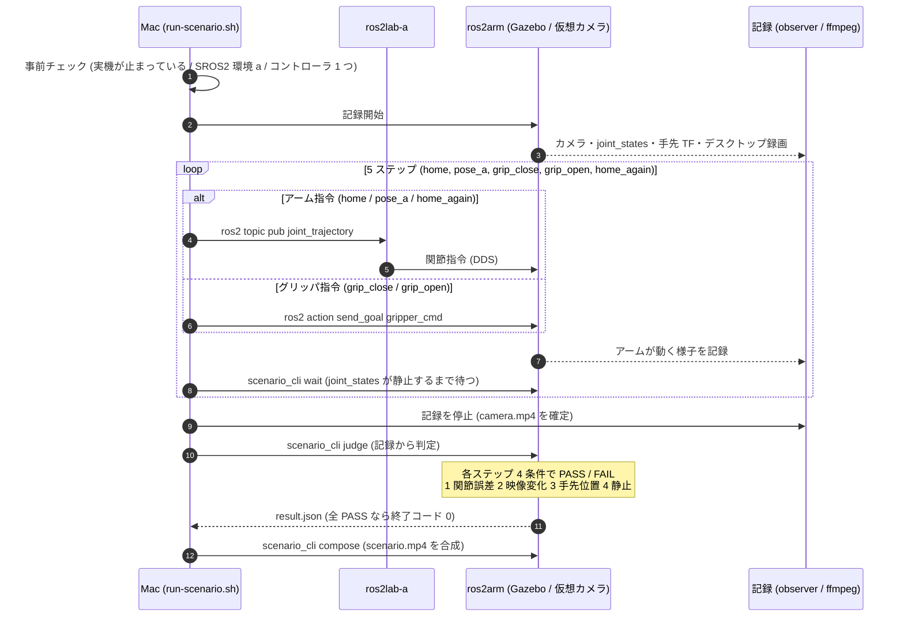
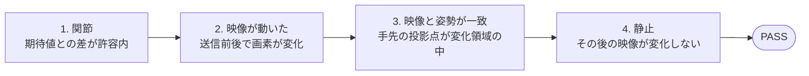

# シナリオ実行の流れ（default シナリオ）

`bash scripts/run-scenario.sh` が 1 回の実行で何をするかを、シーケンス図とフロー図で示す。
使い方・判定条件の詳細は [sim-scenario-recording.md](sim-scenario-recording.md) を参照。

## シーケンス図



## フロー図

```mermaid
flowchart TD
    S([run-scenario.sh]) --> C{事前チェック}
    C -- NG --> E2[終了コード 2<br/>環境・記録の問題]
    C -- OK --> SIM{シミュ起動済み?}
    SIM -- 未起動かつ --start-sim --> START[Gazebo + MoveIt + 仮想カメラを起動]
    SIM -- 起動済み --> REC
    START --> REC[記録開始<br/>カメラ / joint_states / 手先 TF / デスクトップ]
    REC --> STEP[次のステップを取り出す]
    STEP --> KIND{種類}
    KIND -- アーム --> LAB[ros2lab-a から<br/>ros2 topic pub]
    KIND -- グリッパ --> GRIP[ros2arm から<br/>ros2 action send_goal]
    LAB --> WAIT[joint_states が静止するまで待つ]
    GRIP --> WAIT
    WAIT --> MORE{残りのステップ?}
    MORE -- あり --> STEP
    MORE -- なし --> STOP[記録停止]
    STOP --> JUDGE[judge: 各ステップを判定]
    JUDGE --> COMPOSE[compose: scenario.mp4 を合成]
    COMPOSE --> V{全ステップ PASS?}
    V -- はい --> OK([終了コード 0])
    V -- いいえ --> NG([終了コード 1])
```

## 1 ステップの判定（すべて満たして PASS）



## 出力

`workspace/runs/<日時>/` に `scenario.mp4`（左: デスクトップ、右: 仮想カメラ、下帯: 命令と判定）と
`result.json`（ステップごとの判定と数値）などが出る。
